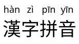
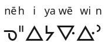
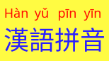

# Rubify - Ruby text annotation generator

Rubify is a fully offline, client-side, configurable [ruby text](https://en.wikipedia.org/wiki/Ruby_character) annotation generator featuring multilingual demo text and PNG, SVG, and HTML output. You can download it and use it locally or visit the online demo [here](https://dohliam.github.io/rubify/).

For technical background on ruby text see the [documentation](https://developer.mozilla.org/en-US/docs/Web/HTML/Element/ruby) on MDN.

## Converting text

There are two different text conversion modes available: **Simple** and **Complex**, depending on the type of script and requirements of the text in question.

### Simple mode

The most straightforward way to create ruby text is using **Simple** mode.

Simple mode allows ruby text to be generated quickly and easily by inputting a string of _base text_ in the **Base characters** box and a corresponding transcription for each character (separated by spaces) in the _Ruby text_ input box below. The two texts will be combined so that the transcription is printed in small text above the base characters.

This mode is designed for the common use case of adding phonetic transcriptions over each syllable of text in a character-based script (most commonly Chinese, Japanese, or Korean).

If there are a different number of characters (in the _Base characters_ box) and words separated by spaces (in the _Ruby text_ box) the program will show an error message. For more complex situations, such as several characters corresponding to one or more words of transcription, or syllable transcription for scripts that are word-based rather than character-based (such as English), **Complex mode** should be used instead.

#### Examples

Click **Demo** and then **Rubify** to see an example of Ruby text (default is Chinese text with Pinyin -- this can be configured to any of a number of different languages in the options menu).

* Base characters: `漢語拼音`
* Ruby text: `Hàn yǔ pīn yīn`

Result:

### Complex mode

For more complicated text, such as a single string of transcription corresponding to multiple characters, you should use **Complex** mode.

* For example, `漢字(hànzì)拼音(pīnyīn)` will show the pinyin for the first two words together and the second words also together
* The above example won't work in simple mode because it parses input character by character

If you want to add phonetic guides to English text with IPA, you will need to use Complex mode:

	English(/ɪŋɡɫɪʃ/) text(/tɛkst/) with(/wɪð/) IPA(/aɪ piː eɪ/)

This works just fine and gives you the result below:

If you try to input `English text with IPA` with the ruby text `/ɪŋɡɫɪʃ/ /tɛkst/ /wɪð/ /aɪ piː eɪ/` in Simple mode, you will get an error, since the converter has no way of knowing that you want to split the base text by spaces (sometimes) but then also by characters (for the string `IPA`).

#### Examples

In theory, any combination of scripts can be used to create ruby text in Complex mode. Below are some further examples to illustrate this.

* Arabic ruby text over Chinese characters:

	北京(بكين)大学(جامعة)

* English ruby text over Russian:

	Красная(Red) площадь(Square)

* Standard Roman Orthography (Cree) ruby text over Canadian Aboriginal Syllabics:

	ᓀ(nē)ᐦ(h)ᐃ(i)ᔭ(ya)ᐍ(wē)ᐏ(wi)ᐣ(n)

(Note: This could also be entered -- perhaps more easily -- using Simple mode as `ᓀᐦᐃᔭᐍᐏᐣ` with ruby text of `nē h i ya wē wi n`)

* English ruby text over French:

	Anneaux(Rings) de(of) Saturne(Saturn)

## Options

The Options menu allows for configuration of text size, text and background colour, ruby text position, and the language of the automated demo text.

### Ruby position

The Ruby text can be placed either above or below the base text. For example, the Korean base text `표준국어대사전` with the ruby transcription `pyo jun gug eo dae sa jeon` by default outputs the ruby text above the main text:

However, when the **Ruby position** option is set to _Below_, the output looks like this:

### Ruby text size

The default Ruby text size is set to `Large`. For example, the input text `重庆火锅` with the ruby text `Chóng qìng huǒ guō` gives the following result:

If the text appears too crowded and/or interferes with the spacing of the base text it can be made more readable by reducing the size of the Ruby text. When the **Ruby text size** option is set to _Small_, the output of the previous example looks like this:

### Base text size

The size of the base text can be changed by adjusting the **Base text size** slider in the Options menu.

### Text and background colour

You can change the colour of the text as well as the background using the colour pickers in the Options menu (click on **Options** and scroll down to see them).

* Click on any colour in the pallette to select it
* Adjust shading using the slider control on the right
* You can also enter colour names or HEX codes directly in the box

Below is an example using the Japanese demo text and typing "blue" and "pink" into the text and background colour pickers respectively:

The colour of the ruby annotation text can optionally be changed separately from the base text. Below is an example using the default demo text with base text, ruby text, and background colour all set to different values:

### Demo text language

You can change the language of the demo text by clicking on **Options** and scrolling down to the dropdown menu labelled _Demo text language_.

The following languages are available:

* Mandarin ([Pinyin](https://en.wikipedia.org/wiki/Pinyin))
* Mandarin ([Bopomofo](https://en.wikipedia.org/wiki/Bopomofo))
* Cantonese ([Jyutping](https://en.wikipedia.org/wiki/Jyutping))
* Japanese ([Furigana](https://en.wikipedia.org/wiki/Furigana))
* Korean ([Hangul](https://en.wikipedia.org/wiki/Hangul))

Once you have selected a language from the list, press the **Demo** button and sample text will automatically be pre-filled in the converter (press **Rubify** to see the result). This can make it easier to experiment with different features and options.

Note that this is not a list of supported languages that can be used with the converter -- in principle, any language or combination of scripts can be used (for example, Arabic transliteration over Chinese text, or Furigana over Cyrillic text, etc -- see [Complex mode](#complex-mode) for examples).

## Output

The converted ruby text can be saved in either HTML or image format.

After pressing **Rubify** to convert some text, it will by default be presented as rendered HTML. To use this directly on a webpage, press the **Show HTML** button and copy the raw HTML. This can be pasted into your HTML editor or other application that accepts HTML.

There are two different image formats available. To download an image of the text in lossless PNG format, click on **Save PNG**. To download the converted text as a vector illustration, click on **Save SVG**.

Examples of output in both formats can be found in the `output` directory.

## Limitations

* Vertical ruby text:
  * Since vertical ruby text (as is typical for example with [Bopomofo](https://en.wikipedia.org/wiki/Bopomofo)) is not yet supported by browsers, Rubify currently only works with horizontal text.
  * There is a [proposed](https://drafts.csswg.org/css-ruby/#rubypos) `inter-character` value for the `ruby-position` element that would provide this, but no browser appears to support it yet.
* RTC:
  * Rubify does not yet support the [Ruby text container element](https://developer.mozilla.org/en-US/docs/Web/HTML/Element/rtc) (`<rtc>`). Browser support for this appears to be [limited to Firefox](https://developer.mozilla.org/en-US/docs/Web/HTML/Element/rtc#Browser_compatibility) at the moment. Pull requests to add support for this are welcome!
* ruby-position:
  * The `ruby-position` CSS property is not supported by any mobile browsers other than Firefox (v38+).
  * As a result, only the default value for `ruby-position` (i.e., `over`) is supported on these browsers.

## To do

* Options:
  * [x] Character font-size slider
  * [x] Base text character spacing
* Interface localization
* Live update as you type?
* Logo & favicon

## Credits

* CSS: [Tacit CSS](https://github.com/yegor256/tacit) by @yegor256 ([MIT](https://github.com/yegor256/tacit/blob/master/LICENSE))
* Save as image: [dom-to-image](https://github.com/tsayen/dom-to-image) by @tsayen ([MIT](https://github.com/tsayen/dom-to-image/blob/master/LICENSE))
* Color picker: [jscolor](https://jscolor.com/) ([GPLv3](http://www.gnu.org/licenses/gpl-3.0.txt))
* Modal windows: [CSS Modal](https://github.com/drublic/css-modal) by @drublic ([MIT](https://github.com/drublic/css-modal/blob/master/LICENSE))
* Api (modularized) by [jomin398](https://github.com/jomin398)

## License

MIT.
